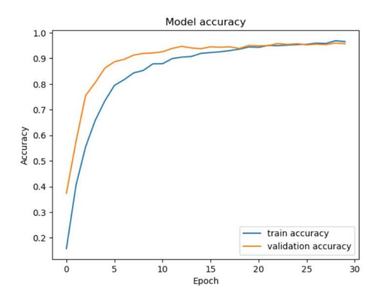
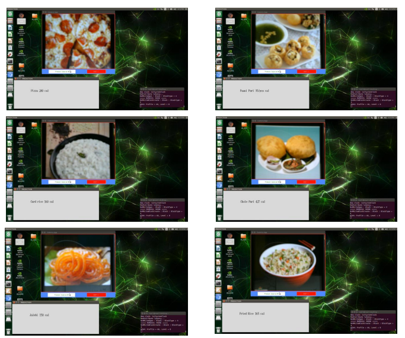

# Food Calorie Predictor

## Abstract

In today's health-conscious era, individuals are increasingly interested in understanding the calorie content of the food they consume. The Food Calorie Predictor project aims to estimate the calorie content of food photos through the application of deep learning and image classification methods. The study utilizes a pre-trained Inception v3 model in conjunction with TensorFlow Keras and ImageDataGenerator for training and testing the model's predictive capabilities regarding the calorie content of food photos.

To enhance the model's performance, the dataset employed in the project is curated from Kaggle and Google and augmented using various methods. The Food Calorie Prediction project has potential applications in diverse contexts, including business analysis, weight control, and healthcare. The initiative contributes significantly to the global campaign promoting healthy eating practices and improving public health outcomes, driven by its accuracy, scalability, and the ability to enhance nutritional knowledge.

## Usage

This project can be utilized in various scenarios, such as:

- **Business Analysis:** Understanding the calorie content of food items for business decision-making.
  
- **Weight Control:** Helping individuals manage and control their calorie intake for weight-related goals.
  
- **Healthcare:** Providing a tool to assess and monitor nutritional aspects for healthcare purposes.

## How it Works

The project employs an Inception v3 model, TensorFlow Keras, and ImageDataGenerator to train and test the model. The dataset, sourced from Kaggle and Google, is enhanced using a variety of methods to improve model performance.

Then the final application is implemented in Jetson Nano which can be used as a standalone device and helps in predicting the calorie.

## Screenshots

  
  
Accuracy

  
  
Output Screenshots

